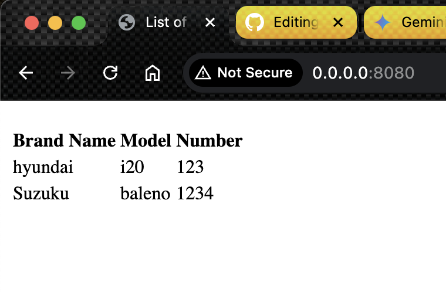

# Ktor Server CRUD App with MongoDB and Thymeleaf


**Description:**

This Ktor application demonstrates basic CRUD (Create, Read, Update, Delete) operations using MongoDB as the database and Thymeleaf for rendering HTML views.

This app was created as part of the co-learning session

Luma Link:
https://lu.ma/opk4nkdr

Subscribe to our events calender:
https://lu.ma/kugchennai

**Technologies:**

* Ktor
* MongoDB
* Thymeleaf
* Programming Language Kotlin
* Build Tool Gradle
* NGROK for tunneling

**Getting Started:**

1. **Clone the repository:**

   ```bash
   git clone [https://github.com/](https://github.com/)<your-username>/ktor-crud-app.git
   ```
   
2. Install Mongo community edition and run the mongo server

https://www.mongodb.com/docs/manual/tutorial/install-mongodb-on-os-x/#std-label-install-mdb-community-macos


3. Gradle Build

    ```bash
   ./gradlew build
   ```

4. Gradle Run

    ```bash
   ./gradlew run
   ```
5. You will start seeing a screen like this if you have data in your db
   

6. Visit the [Databases.kt](src/main/kotlin/example/com/plugins/Databases.kt) file to view the list of api's available


## Contributing

Fork and Create a PR against this repo to contribute !